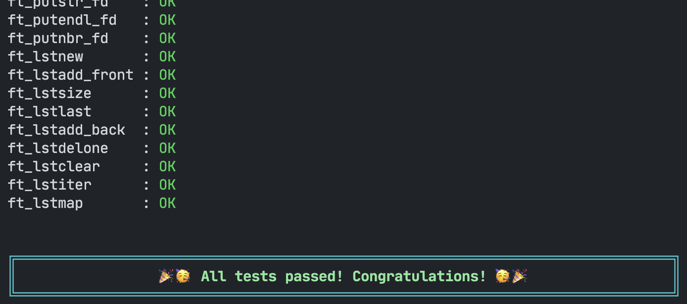
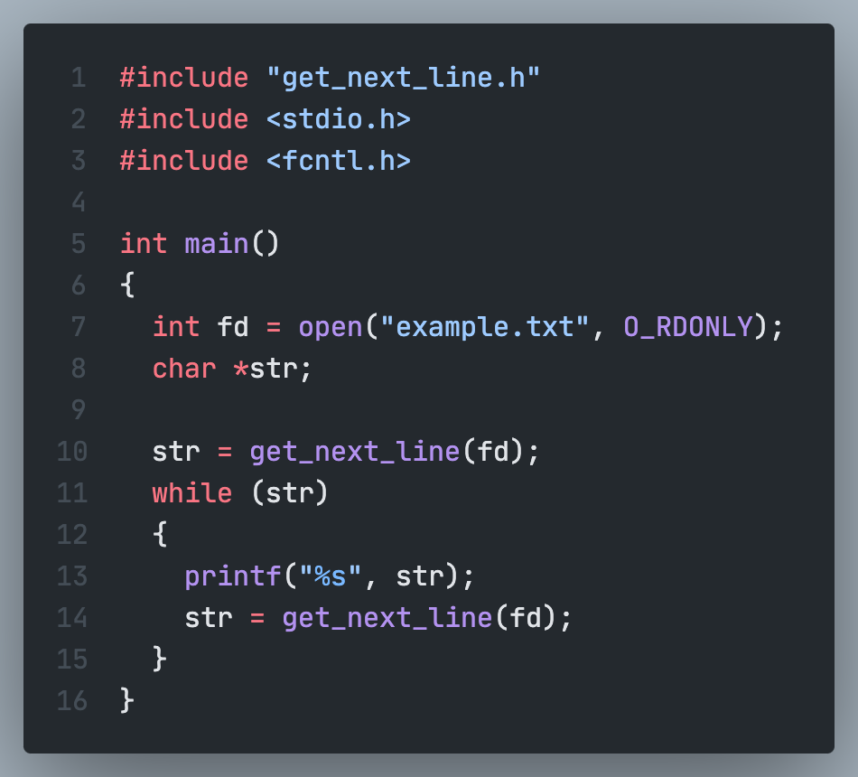
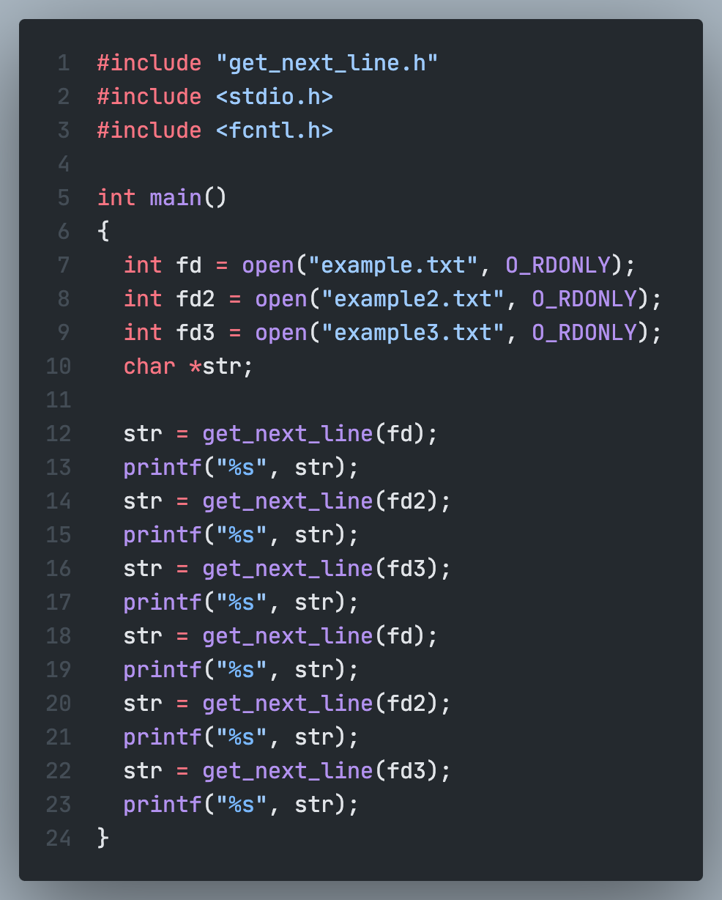
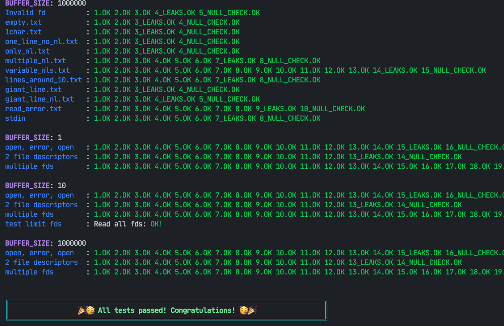
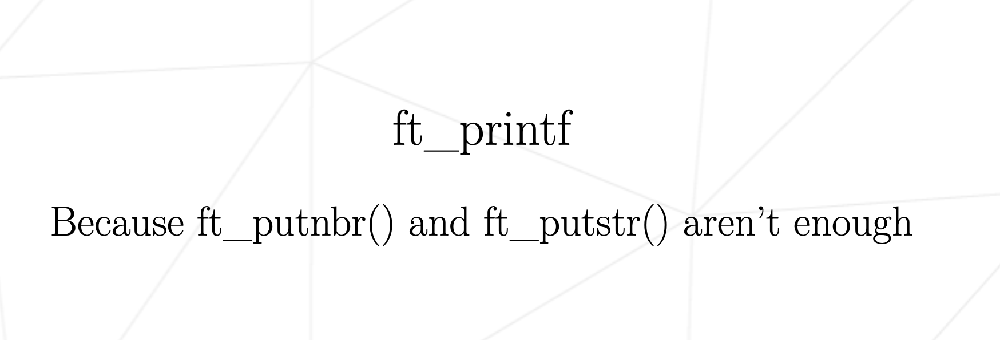
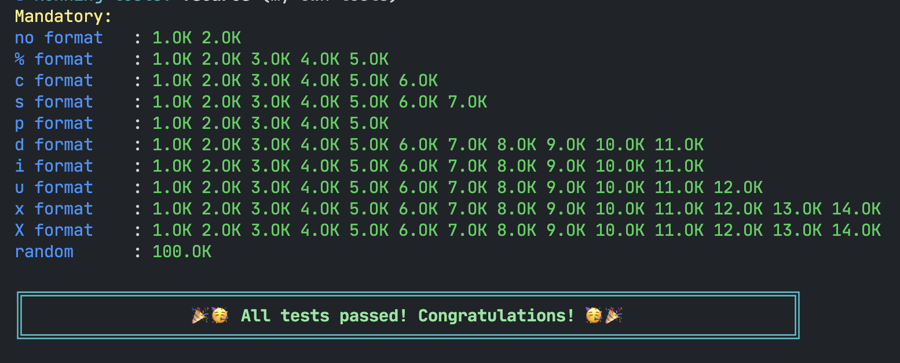
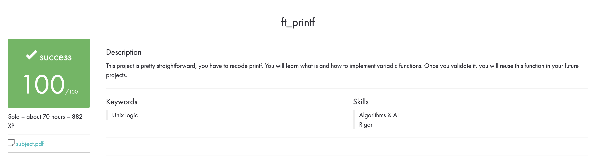

'42 Seoul'을 하면서 진행했던 프로젝트를 기록한 repository입니다.

1. [libft](#libft)
2. [get_next_line](#get_next_line)
3. [ft_printf](#ft_printf)
4. Born2beRoot

    

# LIBFT

<a href="https://github.com/kungbi/42seoul_storage/tree/master/libft"
   style="color: #000; font-size: 20px">
   🔗Repository Link🔗
</a>

## 프로젝트 설명

<string.h> 의 함수들(strdup, atoi, ...)을 구현했으며 그 외에도 문자열을 다루는 편리한 함수들을 구현했습니다. 또한 linked-list를 다루기 위한 함수들도 구현했습니다. 이러한 편리한 기능을을 모두 구현하여 하나의 archive를 구성하는 프로젝트입니다.

## 제약조건

- 전역변수 사용 불가.
- 출력하는 경우 `<unistd.h>`의 `write`만 사용 가능.
- 메모리가 필요할 경우 `<stdlib.h>`의 `malloc`만 사용 가능.
- 절대 memory leak이 발생하면 안된다.

## Part 1 - Libc function

calloc과 strdup 는 malloc을 사용할 수 있으며 다른 함수들을 외부 함수를 사용하지 않는다.

1. isalpha
2. isdigit
3. isalnum
4. isascii
5. isprint
6. strlen
7. memset
8. bzero
9. memcpy
10. memmove
11. strlcpy
12. strlcat
13. toupper
14. tolower
15. strchr
16. strrchr
17. strncmp
18. memchr
19. memcmp
20. strnstr
21. atoi

## Part 2 - Additional functions

1. ft_substr

   문자열에서 특정 부분을 잘라 새로운 문자열을 생성하여 반환하는 함수.

2. ft_strjoin

   두 문자열을 이어붙여 새로운 문자열을 생성하여 반환하는 함수.

3. strtrim

   양 쪽 끝에서 지정한 문자들을 제거한 문자열을 생성하여 반환하는 함수.

4. ft_split

   구분자를 기준으로 문자열을 분할하여 그 결과를 문자열 배열에 저장하여 반환하는 함수.

5. ft_itoa

   인자로 받은 정수를 문자열로 변환하는 함수. 음수 또한 처리되어야 한다.

6. ft_strmapi

   문자열의 각 문자를 순회하여 인자로 받은 함수를 적용하고, 각 문자에 함수가 적용된 새로운 문자열을 생성하여 반환하는 함수.

7. ft_striteri

   문자열의 각 문자를 순회하여 인자로 받은 함수를 적용하는 함수.

8. ft_putchar_fd

   인자로 전달받은 file-descriptor에 문자를 출력한다.

9. ft_putstr_fd

   인자로 전달받은 file-descriptor에 문자열을 출력한다.

10. ft_putendl_fd

    인자로 전달받은 file-descriptor에 문자열을 출력하고, 개행을 출력한다.

11. ft_putnbr_fd

    인자로 전달받은 file-descriptor에 인자로 전달받은 정수를 출력한다.

## Part 3 - Linked list

Linked list를 사용할 때 필요한 함수들이다.

1. ft_lstnew
2. ft_lstadd_front
3. ft_lstsize
4. ft_lstlast
5. ft_lstadd_back
6. ft_lstdelone
7. ft_lstclear
8. ft_lstiter
9. ft_lstmap

---

 

---

   

# GET NEXT LINE

<a href="https://github.com/kungbi/42seoul_storage/tree/master/get_next_line"
   style="color: #000; font-size: 20px">
   🔗Repository Link🔗
</a>

## 프로젝트 설명

File descriptor를 통해 한 줄씩(개행이나 EOF까지) 읽어오는 함구를 구현한 프로젝트입니다. 정적변수를 사용하여 버퍼를 구현하여 아직 출력하지 않은 데이터들을 보존해야 합니다.

## 제약조건

- Heap에 할당된 모든 메모리 공간은 적절하게 해제되어야 한다. Memory leak은 없어야 한다.
- 외부 함수는 `<unistd.h>`의 `read` `<stdlib.h>`의 `malloc`과 `free`만 허용합니다.
- 이 프로젝트를 구현하기 위한 함수는 최대 10개까지 사용할 수 있습니다. (함수 한 개당 25줄 제한)
- 전역 변수는 사용 금지

## Mandatory part

Prototype: `char *get_next_line(int fd)`  
Turn in files: `get_next_line.c`, `get_next_line_utils.c`, `get_next_line.h`  
Parameters: 읽어들일 file의 file descriptor  
Return value: 출력할 줄이 있다면 한 줄을 return하고 출력할 줄이 없거나 에러가 발생하면 NULL을 return한다.  
External functs.: `read`, `malloc`, `free`

- `get_next_line()`을 여러 번 호출할 때마다, 함수는 한 번에 한 줄씩 file descriptor가 가리키는 텍스트 파일을 읽어와야 한다.
- 문자열 한 줄을 읽었다면 반환해야하고, 더이상 읽어올 줄이 없거나 에러가 발생하면 NULL을 반환해야 한다.
- 반환하는 문자열에는 `\n`이 포함되어야 한다.
- `get_next_line_utils.c`에는 구현에 필요한 함수들을 만들 수 있다.
- 컴파일러 호출에 `-D BUFFER_SIZE=n`옵션을 추가한다. `BUFFER_SIZE`는 `read()`호출에 byte size로 사용된다.

완성된 `get_next_line()`은 다음과 같이 사용됩니다.

## Bonus part

- 정적변수를 하나만 사용하여 `get_next_line()`을 구현한다.
- 여러 개의 file descriptor를 한번에 관리할 수 있어야 한다.
- 예를들어, file descriptor 3, 4, 5에 대한 reading thread를 잃지 않은 채로 인자로 입력받은 fd에 해당하는 데이터를 읽을 수 있어야 한다.
- `get_next_line()`을 호출하여 fd 3, fd 4, fd 5를 읽고 다시 fd 3, fd 4 를 읽을 수 있어야 한다.

Bonus를 적용한 `get_next_line()`은 다음과 같이 사용됩니다.

---

 

---

 

---

   

# FT PRINTF

<a href="https://github.com/kungbi/42seoul_storage/tree/master/ft_printf"
   style="color: #000; font-size: 20px">
   🔗Repository Link🔗
</a>

## 프로젝트 설명

putnbr이나 putstr로는 한계가 있다. printf를 만들어보는 프로젝트 입니다. 다만 실제 printf처럼 buffer를 사용하지 않습니다. variadic arguments의 사용 방법에 대해 알 수 있습니다.

## 제약 조건

외부 함수는 malloc, free, write, va_start, va_arg, va_copy, va_end 만 사용가능 합니다.

## Mandatory part

Prototype: `int ft_printf(const char *, ...›`

- libc의 printf를 구현한다.
- 실제 printf처럼 버퍼관리를 하지 않는다.
- 다음의 서식 지정자를 구현한다. `cspdiuxx%`

---

---

 
