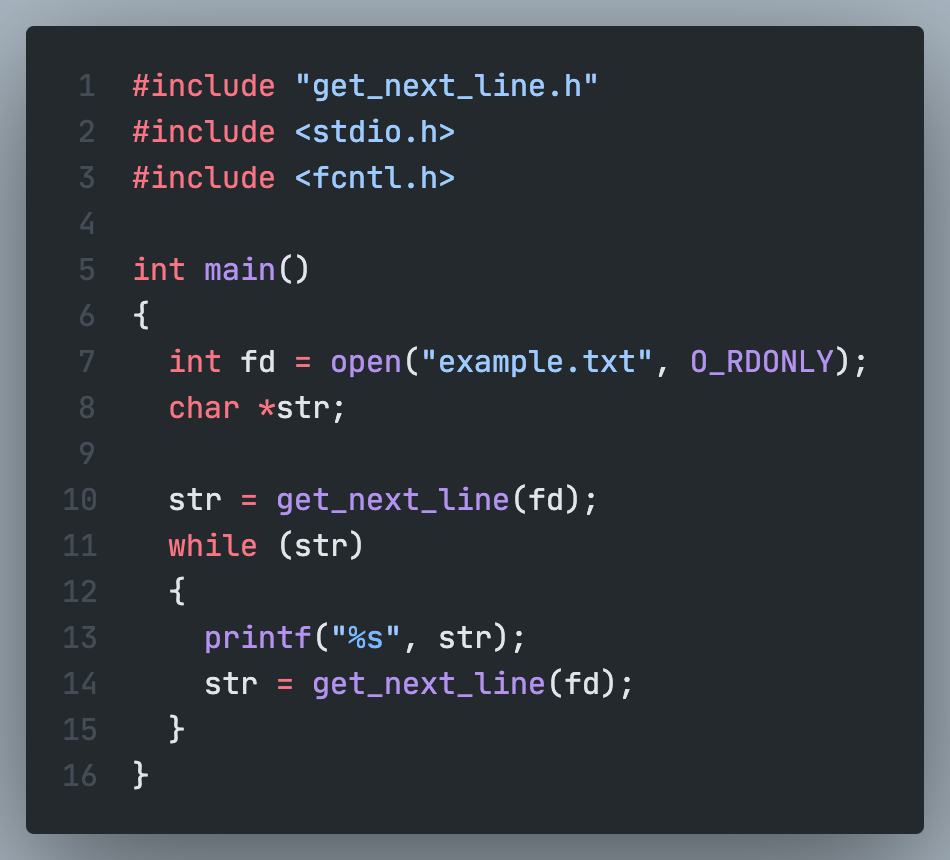
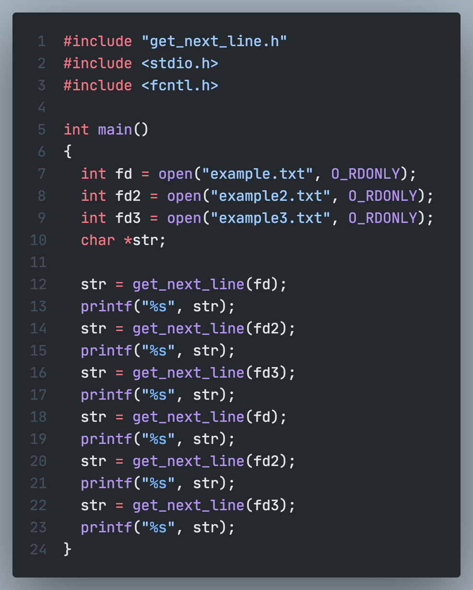

# GET NEXT LINE

<a href="https://github.com/kungbi/42seoul_storage/tree/master/get_next_line"
   style="color: #000; font-size: 20px">
   🔗Repository Link🔗
</a>

## 프로젝트 설명

File descriptor를 통해 한 줄씩(개행이나 EOF까지) 읽어오는 함구를 구현한 프로젝트입니다. 정적변수를 사용하여 버퍼를 구현하여 아직 출력하지 않은 데이터들을 보존해야 합니다.

## 제약조건

- Heap에 할당된 모든 메모리 공간은 적절하게 해제되어야 한다. Memory leak은 없어야 한다.
- 외부 함수는 `<unistd.h>`의 `read` `<stdlib.h>`의 `malloc`과 `free`만 허용합니다.
- 이 프로젝트를 구현하기 위한 함수는 최대 10개까지 사용할 수 있습니다. (함수 한 개당 25줄 제한)
- 전역 변수는 사용 금지

## Mandatory part

Prototype: `char *get_next_line(int fd)`  
Turn in files: `get_next_line.c`, `get_next_line_utils.c`, `get_next_line.h`  
Parameters: 읽어들일 file의 file descriptor  
Return value: 출력할 줄이 있다면 한 줄을 return하고 출력할 줄이 없거나 에러가 발생하면 NULL을 return한다.  
External functs.: `read`, `malloc`, `free`

- `get_next_line()`을 여러 번 호출할 때마다, 함수는 한 번에 한 줄씩 file descriptor가 가리키는 텍스트 파일을 읽어와야 한다.
- 문자열 한 줄을 읽었다면 반환해야하고, 더이상 읽어올 줄이 없거나 에러가 발생하면 NULL을 반환해야 한다.
- 반환하는 문자열에는 `\n`이 포함되어야 한다.
- `get_next_line_utils.c`에는 구현에 필요한 함수들을 만들 수 있다.
- 컴파일러 호출에 `-D BUFFER_SIZE=n`옵션을 추가한다. `BUFFER_SIZE`는 `read()`호출에 byte size로 사용된다.

완성된 `get_next_line()`은 다음과 같이 사용됩니다.

## Bonus part

- 정적변수를 하나만 사용하여 `get_next_line()`을 구현한다.
- 여러 개의 file descriptor를 한번에 관리할 수 있어야 한다.
- 예를들어, file descriptor 3, 4, 5에 대한 reading thread를 잃지 않은 채로 인자로 입력받은 fd에 해당하는 데이터를 읽을 수 있어야 한다.
- `get_next_line()`을 호출하여 fd 3, fd 4, fd 5를 읽고 다시 fd 3, fd 4 를 읽을 수 있어야 한다.

Bonus를 적용한 `get_next_line()`은 다음과 같이 사용됩니다.

---

 

---

 

---

   

